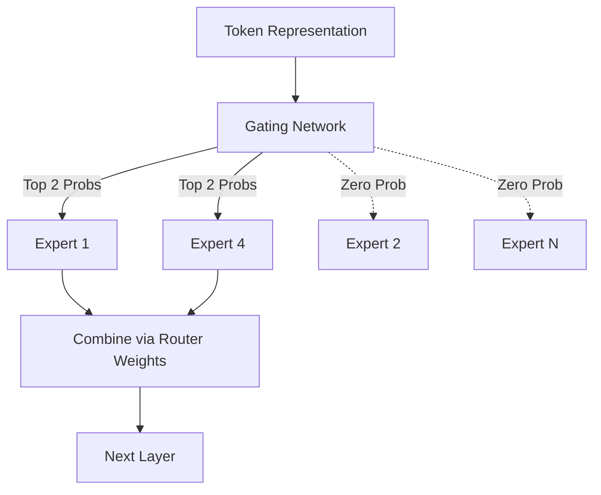

# Architeckt: Architecture Deep Dive

Architeckt is built upon three foundational pillars that differentiate it from standard Transformers: **Linearized Attention**, **Sparse Computation**, and **Adaptive Token Routing**.

---

## 📑 Table of Contents
1. [Multi-Scale Linearized Attention (MSLA)](#1-multi-scale-linearized-attention-msla)
2. [Sparse Mixture of Experts (SMoE)](#2-sparse-mixture-of-experts-smoe)
3. [Adaptive Head Gating (AHG)](#3-adaptive-head-gating-ahg)
4. [Depth-Aware Early Exit (DAEE)](#4-depth-aware-early-exit-daee)
5. [Token-Level Confidence Gate (TLCG)](#5-token-level-confidence-gate-tlcg)

---

## 1. Multi-Scale Linearized Attention (MSLA)

Standard Softmax attention computes a sequence similarity matrix of size $O(L^2)$, making extremely long contexts computationally prohibitive. 

Architeckt utilizes **MSLA**, which approximates attention using a kernel feature map combined with recurrent cumulative sums.

### The Mathematics

Instead of $Softmax(QK^T)V$, MSLA computes:

$$ Attention(Q, K, V) = \frac{\phi(Q) \sum (\phi(K)^T V)}{\phi(Q) \sum \phi(K)^T} $$

Where $\phi(x) = ELU(x) + 1$. 

### Scale Decay
To ensure the model respects local token dependencies as well as global context, we use a multi-scale exponential decay mechanism:
- **Scale 1**: Rapid decay (focuses on adjacent words).
- **Scale 2**: Moderate decay (focuses on the current sentence/paragraph).
- **Scale 3**: No decay (global document context).

> [!TIP]  
> Because the computation can be formulated as a recurrent hidden state (KV-cache of shape `d_head × d_head`), the memory required during inference remains **strictly constant**, regardless of how many tokens are processed!

---

## 2. Sparse Mixture of Experts (SMoE)

Architeckt uses a highly sparse Feed-Forward Network layout.

- **Total Parameters:** ~11 Billion
- **Experts per layer:** 8
- **Active Experts per token:** 2
- **Active Parameters:** ~1.5 Billion

### SwiGLU-T (Thresholded SwiGLU)
Inside each expert, we apply a novel activation function: `SwiGLU-T`. By learning a dynamic threshold per layer, tokens that do not strongly activate a neuron are strictly zeroed out. This induces 10-30% sparsity within the active experts themselves.

---

## 3. Adaptive Head Gating (AHG)

Not all tokens require 32 attention heads. While complex entities (like "quantum entanglement") require deep semantic resolution, simple syntax tokens (like "the", "a", "in") do not.

AHG learns a gating value $g \in (0, 1)$ for each head. During inference, we drop a fixed percentile of the lowest-scoring heads, bypassing their computation entirely.

> [!NOTE]
> Tests show this saves up to 30% of attention FLOPs without measurable loss in perplexity.

---

## 4. Depth-Aware Early Exit (DAEE)

*Note: Scheduled for future implementation.*

DAEE predicts whether a token has been fully resolved at an intermediate layer. If the model's confidence exceeds a dynamic threshold, it routes the token directly to the Output LM Head, skipping all subsequent Transformer blocks.

---

## 5. Token-Level Confidence Gate (TLCG)

TLCG computes a continuous `confidence` scalar. If confidence is low, the model can automatically request external retrieval (RAG) or allocate more compute steps (Adaptive Compute Time).
