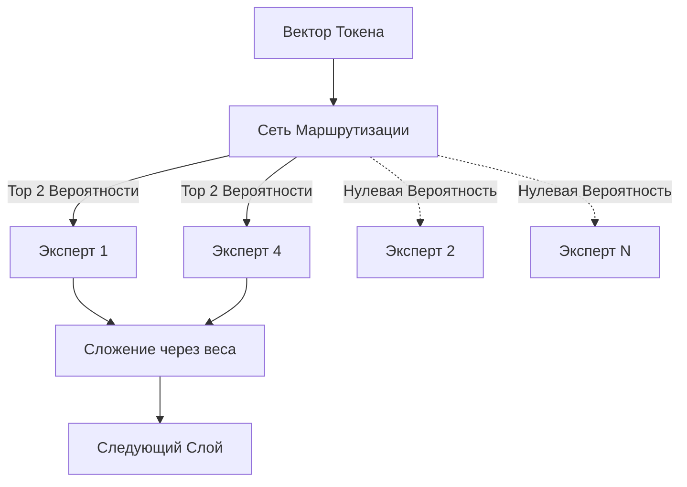

# Architeckt: Архитектура (Deep Dive)

Архитектура Architeckt зиждется на трех фундаментальных столпах, отличающих её от стандартных Трансформеров: **Линейное Внимание**, **Разреженные Вычисления** и **Адаптивная Маршрутизация Токенов**.

---

## 📑 Содержание
1. [Multi-Scale Linearized Attention (MSLA)](#1-multi-scale-linearized-attention-msla)
2. [Sparse Mixture of Experts (SMoE)](#2-sparse-mixture-of-experts-smoe)
3. [Adaptive Head Gating (AHG)](#3-adaptive-head-gating-ahg)
4. [Depth-Aware Early Exit (DAEE)](#4-depth-aware-early-exit-daee)
5. [Token-Level Confidence Gate (TLCG)](#5-token-level-confidence-gate-tlcg)

---

## 1. Multi-Scale Linearized Attention (MSLA)

Стандартное внимание Softmax вычисляет матрицу схожести размером $O(L^2)$, что делает обработку длинных текстов невозможной из-за нехватки памяти.

Architeckt использует **MSLA** — метод, аппроксимирующий внимание через ядерную функцию (kernel) в сочетании с рекуррентными кумулятивными суммами.

### Математика

Вместо $Softmax(QK^T)V$, MSLA вычисляет:

$$ Attention(Q, K, V) = \frac{\phi(Q) \sum (\phi(K)^T V)}{\phi(Q) \sum \phi(K)^T} $$

Где $\phi(x) = ELU(x) + 1$.

### Масштабирование (Scale Decay)
Чтобы модель не забывала локальный контекст в угоду глобальному, мы используем мульти-масштабное экспоненциальное затухание:
- **Масштаб 1**: Быстрое затухание (фокус на соседних словах).
- **Масштаб 2**: Среднее затухание (фокус на предложении).
- **Масштаб 3**: Отсутствие затухания (глобальный контекст всего документа).

> [!TIP]  
> Поскольку эти вычисления можно переписать в виде рекуррентного скрытого состояния (KV-кэш размером `d_head × d_head`), потребляемая память при инференсе остается **строго константной**, независимо от количества сгенерированных токенов!

---

## 2. Sparse Mixture of Experts (SMoE)

Architeckt использует высокоразреженную архитектуру Feed-Forward сетей (FFN).

- **Всего параметров:** ~11 Миллиардов
- **Экспертов на слой:** 8
- **Активных экспертов на токен:** 2
- **Активных параметров:** ~1.5 Миллиарда

### SwiGLU-T (Пороговый SwiGLU)
Внутри каждого эксперта применяется наша проприетарная функция: `SwiGLU-T`. Изучая динамический порог для каждого слоя, токены со слабой активацией жестко обнуляются. Это создает 10-30% "мертвых зон" внутри уже активных экспертов, экономя энергию процессора.

---

## 3. Adaptive Head Gating (AHG)

Не каждому слову нужны 32 головы внимания. Если сложные термины (например, "квантовая физика") требуют глубокого семантического анализа, то предлоги ("и", "в", "на") обрабатываются тривиально.

AHG обучает специальный вентиль (gate) $g \in (0, 1)$ для каждой головы. При генерации текста мы аппаратно отключаем заданный процент голов с самыми низкими значениями.

> [!NOTE]
> Тесты показывают, что это экономит до 30% вычислений без потери качества (Perplexity).

---

## 4. Depth-Aware Early Exit (DAEE)

*Примечание: Запланировано к реализации.*

DAEE предсказывает, был ли токен "понят" на ранних слоях. Если уверенность модели превышает порог, токен отправляется напрямую в выходной слой LM Head, пропуская десятки оставшихся блоков Трансформера.

---

## 5. Token-Level Confidence Gate (TLCG)

TLCG вычисляет скаляр `уверенности`. Если уверенность модели падает, она может автоматически запросить внешние данные (RAG) или потратить больше вычислительных тактов (Adaptive Compute Time) на обдумывание сложного слова.
